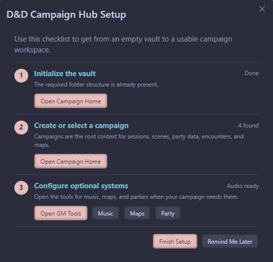
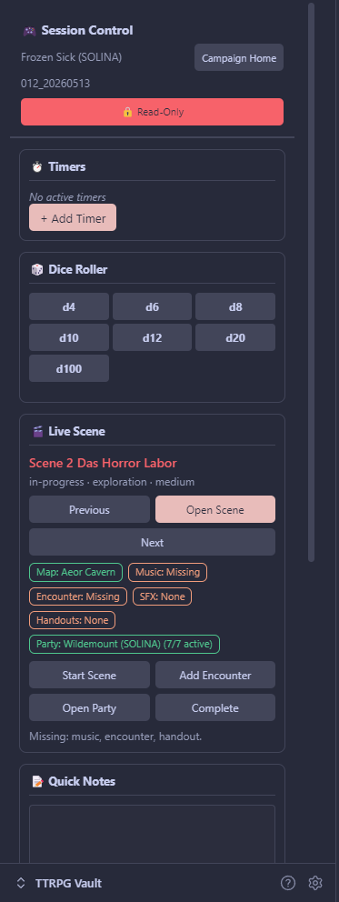

# Get Started

This quickstart gets a new vault from install to a runnable first session.

If you are installing the plugin manually from GitHub, see the more detailed [First Steps guide](first-steps.md).

## Install

### Community Plugins

1. Open **Settings** -> **Community plugins** -> **Browse**.
2. Search for **D&D Campaign Hub**.
3. Select **Install**, then **Enable**.

### Manual Install

1. Download `main.js`, `manifest.json`, and `styles.css` from the [latest release](https://github.com/kmumenthaler/dnd-campaign-hub/releases).
2. Create `.obsidian/plugins/dnd-campaign-hub/` inside your vault.
3. Copy the three files into that folder.
4. Reload Obsidian and enable **D&D Campaign Hub** under **Community plugins**.

## First 15 Minutes

### 1. Run Setup

Open the Command Palette and run **D&D Hub: Open Setup Wizard**.

Use the wizard to choose or create:

| Choice | What it does |
| --- | --- |
| Campaign folder | Creates the campaign structure under `ttrpgs/` |
| Audio folder | Connects music, playlists, and inline sound effects |
| Map/token folders | Prepares battle maps and token storage |
| Starter content | Creates a campaign, first session, and party folder |

You can skip optional systems and return later from **Settings** -> **D&D Campaign Hub** -> **Setup**.

### 2. Open Campaign Home

Run **D&D Hub: Open Campaign Home**.

Campaign Home is the main place to orient yourself. Select the active campaign from the dropdown. That selection is used by session creation, encounter building, party tools, and other campaign-aware actions.

Use these buttons first:

| Button | Use it when |
| --- | --- |
| **New Session** | You need the next session note |
| **Continue Last Session** | You want to reopen the latest session and linked scene/adventure |
| **Create Content** | You want one menu for sessions, scenes, characters, encounters, maps, and world notes |
| **Build Encounter** | You want the encounter builder with the campaign party selected |
| **Open Party** | You want to review or update the campaign party |

### 3. Prepare

For a minimal first session:

1. Select your campaign in Campaign Home.
2. Select **New Session**.
3. Add a short session title.
4. Link an adventure if you already have one, or leave it blank.
5. Use **Create Content** to add one scene.

Scenes can link maps, encounters, music, sound effects, and handouts. Missing links are shown as next-step prompts in the prep and run dashboards.

See [Prepare a Session](prepare-a-session.md) for the full workflow.

### 4. Run

When it is time to play, run **D&D Hub: Start Session**.

The Session Run Dashboard is the live control surface. It shows the current scene and gives quick access to linked maps, encounters, music, sound effects, handouts, and party state.

See [Run a Session](run-a-session.md) for the live workflow.

### 5. Review and Continue

After a session, keep the session note as the record of what happened. Next time, use **Continue Last Session** from Campaign Home to reopen the latest session note and its linked adventure scene when available.

See [Recover or Continue a Session](recover-continue-session.md) for details.

## Optional Plugins

D&D Campaign Hub works standalone. These community plugins can improve specific workflows:

| Plugin | Purpose |
| --- | --- |
| [Calendarium](https://github.com/javalent/calendarium) | Fantasy calendar integration |
| [Templater](https://github.com/SilentVoid13/Templater) | Template engine for dynamic content |
| [Fantasy Statblocks](https://github.com/javalent/fantasy-statblocks) | Creature and PC stat block rendering |

## Main Workflow Commands

| Command | Purpose |
| --- | --- |
| `D&D Hub: Open Setup Wizard` | Run or revisit first-time setup |
| `D&D Hub: Open Campaign Home` | Open the main campaign dashboard |
| `D&D Hub: Create Content` | Create common campaign content from one menu |
| `D&D Hub: Prepare Next Session` | Open the prep dashboard |
| `D&D Hub: Start Session` | Open the live run dashboard |
| `D&D Hub: Open GM Tools` | Open common live-play tools |

## Next Guides

- [Prepare a Session](prepare-a-session.md)
- [Run a Session](run-a-session.md)
- [Build a Scene with Map, Encounter, and Music](build-scene-map-encounter-music.md)
- [Recover or Continue a Session](recover-continue-session.md)
- [Campaign management](campaign-management.md)
- [Sessions](sessions.md)
- [Adventures and scenes](adventures-and-scenes.md)
- [Battle maps](battle-maps.md)
- [Encounter builder](encounter-builder.md)
- [Music player](music-player.md)
- [Party management](party-management.md)
- [Settings and reference](settings-and-reference.md)
