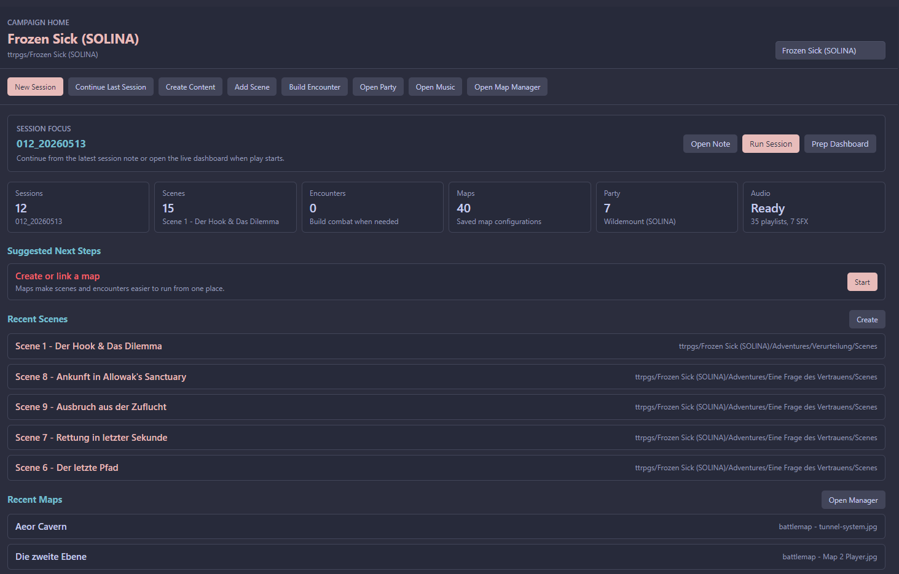
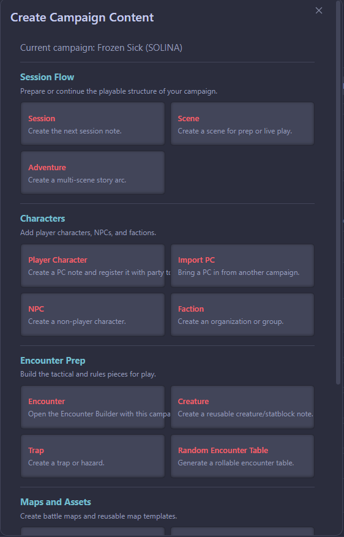

# Prepare a Session

Use this workflow when you are planning the next game.

## Start From Campaign Home

1. Run **D&D Hub: Open Campaign Home**.
2. Select the active campaign from the dropdown.
3. Review **Session Focus** and **Suggested Next Steps**.

Campaign Home is campaign-aware. The selected campaign is passed into session creation, scene creation, encounter building, party tools, and map/music shortcuts.

## Create or Open the Session

Use **New Session** when you are preparing a new game.

Use **Continue Last Session** when you want to reopen the latest session note and the most relevant linked adventure scene. If no scene is linked, the plugin opens the linked adventure. If no adventure is linked, it opens the session note.

## Add the Core Pieces

For a usable prep pass, aim for these links:

| Piece | Where to create/open it |
| --- | --- |
| Scene | Campaign Home -> **Create Content** -> **Scene** |
| Party | Campaign Home -> **Open Party** |
| Encounter | Campaign Home -> **Build Encounter** |
| Map | Campaign Home -> **Open Map Manager** or scene inline controls |
| Music/SFX | Campaign Home -> **Open Music** |

The prep and run dashboards show action prompts when common links are missing.

## Keep Notes Readable

Use the note body for the material you want at the table: summary, boxed text, NPC motives, clues, consequences, and reminders.

Use frontmatter, action bars, and inline controls for machine-readable links. New templates are designed to keep the visible note body short and human-readable.
